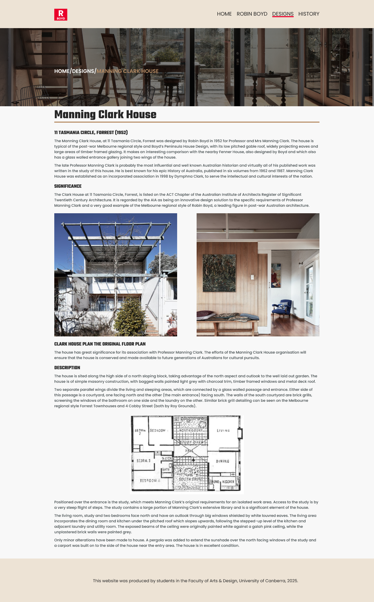

# 11056-RobinBoyd – Project Rationale

## Student ID: U3270100

## 📌 01. Overview

This project involved translating a high-fidelity prototype into a fully responsive website using semantic HTML5 and modern CSS3. The main focus throughout development was to build a clean, maintainable, and accessible codebase, while ensuring the layout adapted smoothly across desktop, tablet, and mobile viewports using CSS Grid, Flexbox, and media queries. The project provided me with a practical insight into front-end web development, common challenges, and industry best practices.

## ✅ What Went Well

### 🔤 Use of BEM Naming Convention

One of the most challenging things in development is naming variables and functions in a way that actually makes sense. I found that following a consistent naming convention makes this process much easier. To address this, I adopted the BEM (Block Element Modifier) naming convention. BEM for naming classes (e.g., **nav\_\_logo, breadcrumb\_\_link, article\_\_title**), helped me keep my CSS structured and maintainable. BEM’s modular approach also helped me reduce styling conflicts that can occur due to the CSS Specificity and improved code readability. It made updating and reusing code across the site much easier and consistent. The main idea of BEM is to divide the user interface into independent blocks which allows for reuse and modularity between CSS classes (BEM, n.d.).

### 🧱 12-Column Grid System

One of the first things I built during the project setup was a 12-column grid system for example, the **grid-container, grid\_\_row, and grid\_\_col-\[sm|md|lg\]--\[1...12\]** classes helped structure the page layout using CSS Grid. Creating this layout foundation early on made it much easier to structure pages consistently and maintain responsive design throughout the development. It provided flexibility for content placement and ensured a clean, organised layout across all screen sizes (MDN Contributors, n.d.-a).

### 🎨 Use of CSS Variables
 
Throughout the project, I consistently used CSS variables (e.g., **--space-l, --translate-length, --duration, --ff-primary**) to manage spacing, animations, font sizes, colour scheme, and layout settings. This approach made the codebase more scalable and maintainable, allowing me to make global adjustments easily and ensure design consistency across components (MDN Contributors, n.d.-b).

I applied private CSS variables within specific components (e.g., **animate**) to localise animation settings such as --**translate-length** and **--duration**. This approach allowed for flexible customisation without polluting the global namespace, making the codebase more modular and preventing conflicts across components.

### 🔁 Reusable, Modular Components
  
Another aspect that contributed to development efficiency was building core components in a modular, reusable way. Elements like the navigation bar, hero sections, and content layout blocks were designed to be responsive and used consistently across the site. Structuring components this way reduced duplication, ensured design consistency, and simplified maintenance. For example, a single .nav component supported both desktop and mobile states, while shared styles for grid layouts allowed flexibility across different pages. This reuse of well-structured components contributed to a more scalable website. It also aligned well with the DRY (Don’t Repeat Yourself) principle and kept the codebase scalable.

### 🚧 Transition from High-Fidelity Prototypes to Website Development

A lot of the hard work was done during the process of creating high-fidelity prototypes for both desktop and mobile versions, including decisions on layout, font and colour selection, and typography. By finalising these details upfront, it made the website translation process much easier and more efficient. This technique significantly reduced build time, as many design choices were already established in the prototypes.

### 🛠️ GitHub for Source Control 
 
Throughout the project, I consistently used GitHub for version control. This helped me track changes, manage different stages of development, and revert code changes when necessary. It also provided a clean and organised history of the project code check-ins.

### 📱 Mobile-First Approach

The project followed a mobile-first approach, where styles and layout were initially designed for smaller screens and then gradually improved for larger viewports. This method ensures better performance and accessibility on mobile devices, which are the most common way users access websites today. Starting with the mobile layout helped simplify the design decisions and made the site more responsive and adaptive from the beginning (Interaction Design Foundation, n.d.).

## 🔄 What Could Have Gone Better

Despite the project’s overall success, there were areas that could have been improved. One challenge was managing time efficiently across building pages. While the early setup (e.g., grid system, variables, and structure) was strong which meant that less time was left for polishing finer UI/UX details such as accessibility enhancements. For example, more attention could have been given to ARIA support for interactive components.

Another area for improvement was testing across different browsers and devices. While the site performed well on major modern browsers, there were minor layout inconsistencies on some less common screen sizes that could have been resolved earlier with more testing strategies.

While GitHub was used consistently throughout the project, commit messages could have been clearer and more descriptive. Writing clearer commit messages and use of github branches for experimental component building would have made the version history more understandable and professional.

Lastly, even though the high-fidelity prototypes helped streamline development, I could have documented component behaviour (e.g., hover states, transitions) in more detail during the design phase. This would have made translation from design to development even smoother.

## ✏️ Prototypes: What Changed and Why

The Figma prototype provided a strong foundation for the website’s layout and visual style. Most elements were implemented closely, including the grid-based layout, colour palette, font selections, and general spacing between components. However, several thoughtful changes were made during development based on testing and refinement. For example, the original design featured a static navigation bar across all screen sizes. After testing on actual mobile devices, I realised that the static nav took up too much screen real estate, so I replaced it with a responsive hamburger menu to improve usability and space efficiency.

The hero section’s height was increased beyond what was shown in the prototype to create more visual impact and better support the featured content. In the sub-hero section, the initial design included a stacked image layout, but during implementation it became clear that this approach disrupted the clean and minimal aesthetic of the rest of the site. I simplified it to a single image for better visual alignment and clarity.

Additionally, a “Back to Top” button was not present in the original design but was added during development to improve user navigation especially on mobile and long-scroll pages. Some image selections also changed slightly from the prototype, either due to availability or to better match the design of the page.

### Figma Prototypes

|                             Desktop                             |                                 Mobile                                 |
| :-------------------------------------------------------------: | :--------------------------------------------------------------------: |
|     Home Page       |     Home Page       |
| Robin Boyd Page   | Robin Boyd Page   |
|  Designs Page   |  Designs Page   |
| Content Page  | Content Page  |

## 🔗 Live Website

[🌐 View Live Site Here](https://jasmeens-sandbox.github.io/11056-RobinBoyd/index.html)  

## 🤖 Use of Generative AI

I used generative AI tools (ChatGPT) during the planning and refine documentation, and get feedback on best practices. All code was written and tested manually.

## 📚 Annotated Resources

- BEM. (n.d.). Quick start. BEM methodology. Retrieved April 01, 2025, from  
  [https://en.bem.info/methodology/quick-start/](https://en.bem.info/methodology/quick-start/)

- MDN Contributors. (n.d.). CSS grid layout. Mozilla Developer Network. Retrieved April 01, 2025, from  
  [https://developer.mozilla.org/en-US/docs/Web/CSS/CSS_grid_layout](https://developer.mozilla.org/en-US/docs/Web/CSS/CSS_grid_layout)

- MDN Contributors. (n.d.). Using CSS custom properties. Mozilla Developer Network. Retrieved April 03, 2025, from   
  [https://developer.mozilla.org/en-US/docs/Web/CSS/CSS_cascading_variables/Using_CSS_custom_properties](https://developer.mozilla.org/en-US/docs/Web/CSS/CSS_cascading_variables/Using_CSS_custom_properties)

- Interaction Design Foundation. (n.d.). Mobile-first. Interaction Design Foundation. Retrieved April 05, 2025, from  
  [https://www.interaction-design.org/literature/topics/mobile-first](https://www.interaction-design.org/literature/topics/mobile-first)
  
- W3Schools. (n.d.). How to scroll to top. W3Schools. Retrieved April 05, 2025, from [https://www.w3schools.com/howto/howto_js_scroll_to_top.asp](https://www.w3schools.com/howto/howto_js_scroll_to_top.asp)

- Trimble, R. (2024, September 19). Animation. CSS-Tricks. Retrieved April 06, 2025, from [https://css-tricks.com/almanac/properties/a/animation/](https://css-tricks.com/almanac/properties/a/animation/)

- Coyier, C. (2024, December 16). Font-size. CSS-Tricks. Retrieved April 07, 2025, from [https://css-tricks.com/almanac/properties/f/font-size/](https://css-tricks.com/almanac/properties/f/font-size/)